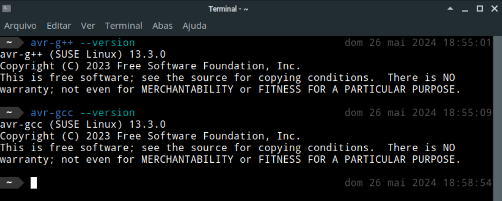

# Compilador para AVR

O compilador para microcontroladores AVR permite a criação de binários que podem ser gravados em chips, como o ATmega328P, presente nas placas Arduino.

## Instalação

Para instalar o compilador, execute o comando:

```bash
sudo zypper install cross-avr-gcc13 avr-libc cross-avr-binutils
```

A versão padrão atual é a **13**, porém, há outras versões do compilador que podem ser instaladas. Para instalar a versão **7**, por exemplo, execute o comando:

```bash
sudo zypper install cross-avr-gcc7 avr-libc cross-avr-binutils
```

Para instalar a versão **12**, execute o comando:

```bash
sudo zypper install cross-avr-gcc12 avr-libc cross-avr-binutils
```

Para instalar a versão **14**, execute o comando:

```bash
sudo zypper install cross-avr-gcc14 avr-libc cross-avr-binutils
```

Você pode verificar se o compilador foi instalado corretamente executando o comando:

```bash
avr-g++ --version
```

Para a versão **13**, a saída será:

```
avr-g++ (SUSE Linux) 13.3.0
Copyright (C) 2023 Free Software Foundation, Inc.
This is free software; see the source for copying conditions.  There is NO
warranty; not even for MERCHANTABILITY or FITNESS FOR A PARTICULAR PURPOSE.
```



## Uso

Abaixo, é exemplificada a compilação de um código-fonte em C++ para o microcontrolador ATmega328P:

```bash
avr-g++ -mmcu=atmega328p main.cpp -o main.elf 
```