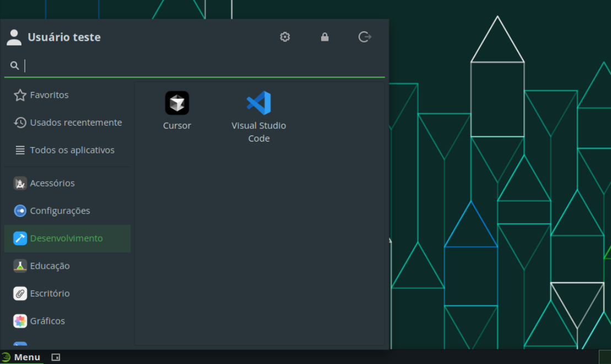

# Cursor

O Cursor é uma IDE com inteligência artificial integrada e que permite o uso de vários modelos para auxiliar no desenvolvimento de código.

## Instalação e atualização

Para facilitar a instalação e atualização, foi criado uma rotina que automatiza o processo, de forma que, com um simples comando, a ferramenta é instalada ou atualizada.

Para instalar ou atualizar o Cursor, execute o seguinte comando:

```bash
curl -sL https://github.com/jpmsb/preparando-computador-para-engenharia-de-tele/raw/main/scripts-auxiliares/instalar-cursor | bash
```

Será perguntado pela senha do seu usuário para prosseguir a instalação. Após a ferramenta ter sido instalada, você pode abri-la digitando `cursor` no terminal ou pelo menu de aplicativos em **Menu** &rarr; **Desenvolvimento** &rarr; **Cursor**.



## Desinstalação

Basta desinstalar o pacote utilizando o gerenciador de pacotes Zypper:

```bash
sudo zypper remove cursor
```