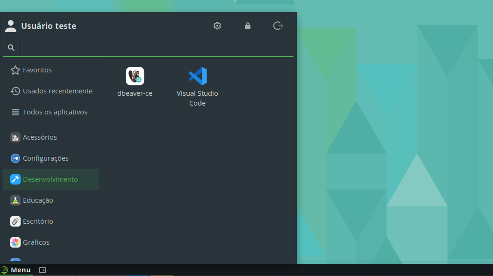
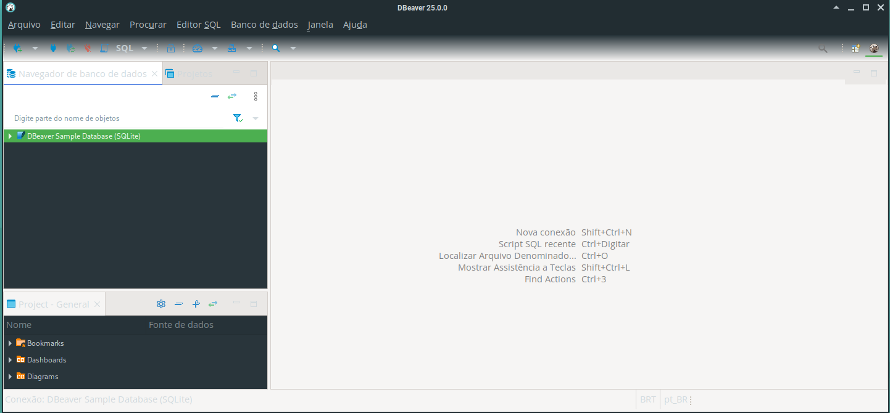
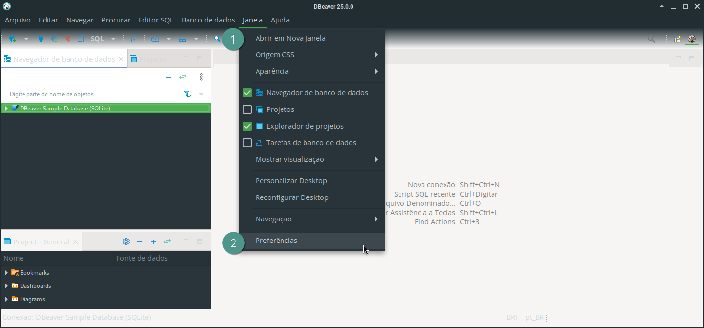
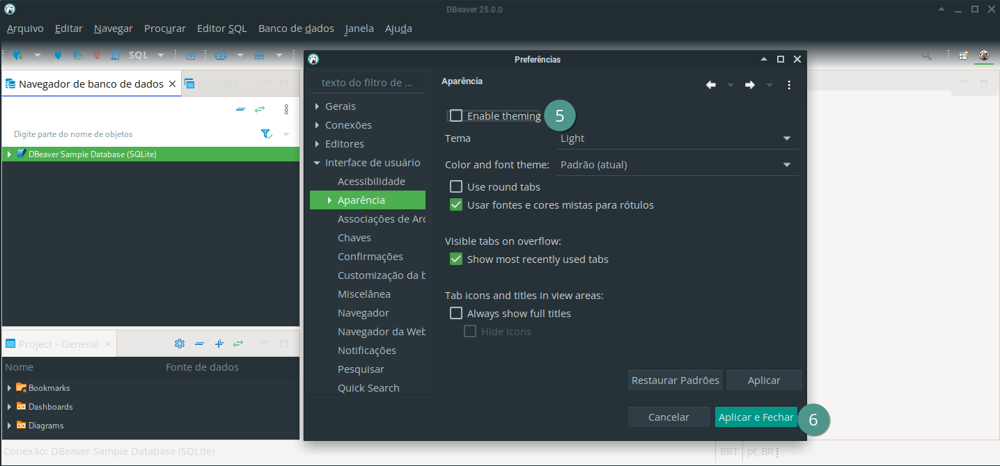
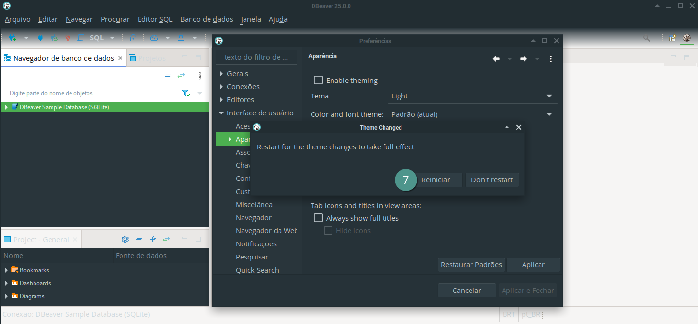
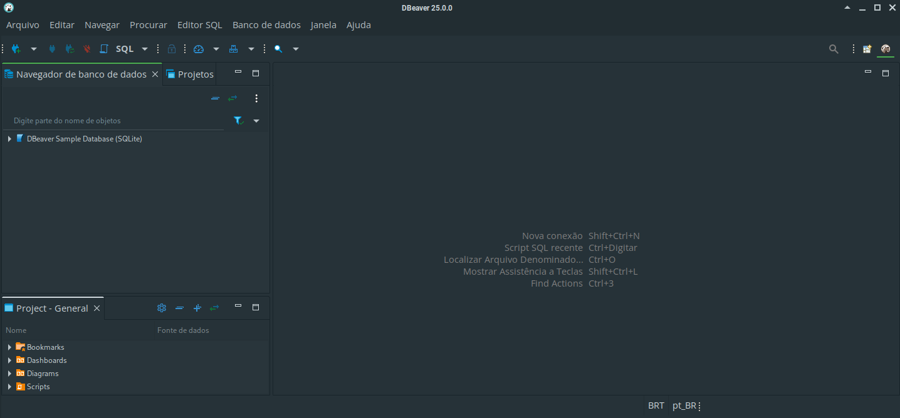
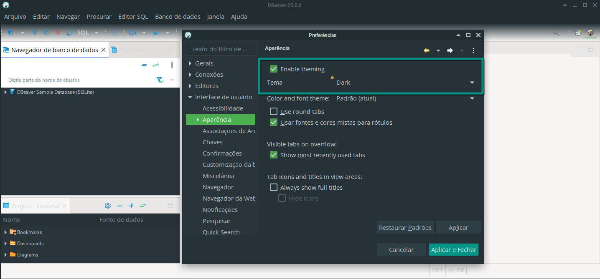
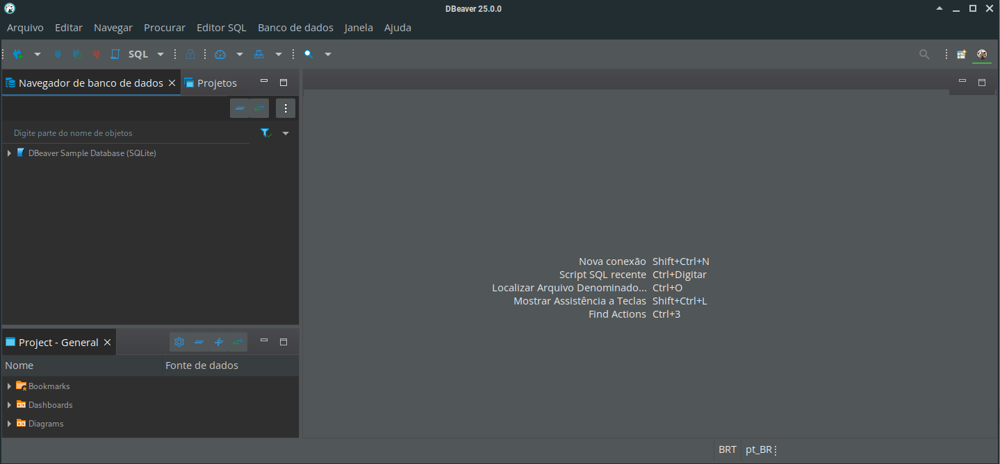
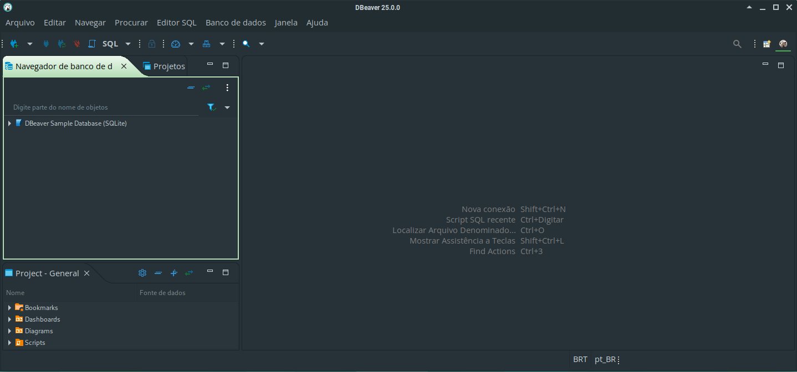

# DBeaver

O DBeaver é uma ferramenta para trabalhar com banco de dados.

## Instalação

Para instalar o DBeaver, execute o comando abaixo:

```bash
sudo zypper install --allow-unsigned-rpm https://dbeaver.io/files/dbeaver-ce-latest-stable.x86_64.rpm
```

Após a ferramenta ter sido instalada, você pode abri-la digitando `dbeaver` ou `dbeaver-ce` no terminal, ou pelo menu de aplicativos em **Menu** &rarr; **Desenvolvimento** &rarr; **dbeaver-ce**.



## Uso

Quando iniciado pela primeira vez, o tema claro da aplicação pode não ter uma boa harmonia visual com o tema escuro do sistema, ficando semelhante à imagem abaixo:



Para ajustar o tema, basta ir em no menu "Janela" &rarr; "Preferências":



Em seguida, vá em "Interface de usuário" &rarr; "Aparência":


Em seguida, desmarque a opção "Enable theming":



Ao clicar em "Aplicar e Fechar", será solicitado o reinício da aplicação:



Após reiniciado, o DBeaver estará com o tema do sistema:



Alternativamente, é possível utilizar o tema escuro da aplicação. Para tal, vá em "Janela" &rarr; "Preferências" &rarr; "Interface de usuário" &rarr; "Aparência" e selecione o tema "Dark":



Ao clicar em "Aplicar e Fechar", será solicitado o reinício da aplicação, bastando clicar em "Reiniciar".

Após reiniciado, o DBeaver estará com o tema escuro próprio:



Outro tema que pode ser usado é o "High Contrast":



Por fim, também possível alterar o tema do sistema para a versão clara, que entra em harmonia com o tema "Light" do DBeaver.

## Desinstalação

Para desinstalar o DBeaver, execute o comando abaixo:

```bash
sudo zypper remove dbeaver-ce
```