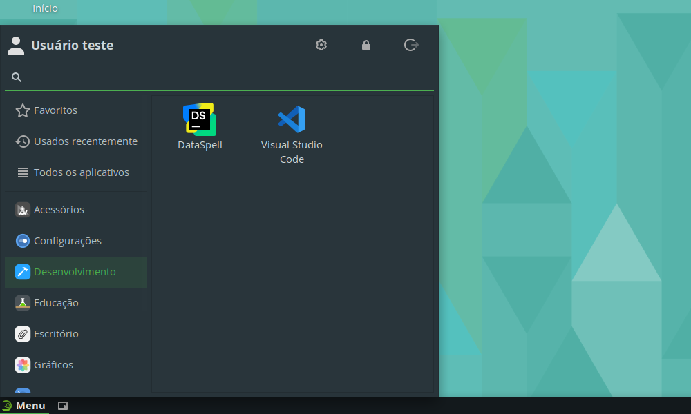

# DataSpell

O DataSpell é uma IDE da JetBrains com foco em ciência de dados.

## Instalação

Para facilitar a instalação, foi criado um *script* que automatiza o processo, de forma que, com um simples comando, a IDE é instalada.

Para instalar o DataSpell, execute o seguinte comando:

```bash
curl -sL https://github.com/jpmsb/preparando-computador-para-engenharia-de-tele/raw/main/scripts-auxiliares/instalar-dataspell | bash
```

Será perguntado pela senha do seu usuário para prosseguir a instalação. Após a IDE ter sido instalada, você pode abri-la digitando `dataspell` no terminal ou pelo menu de aplicativos em **Menu** &rarr; **Desenvolvimento** &rarr; **DataSpell**.



## Desinstalação

Basta remover os arquivos e diretórios criados pelo *script* de instalação.

```bash
sudo rm -r /opt/JetBrains/DataSpell* /usr/share/applications/dataspell.desktop /usr/local/bin/dataspell
```