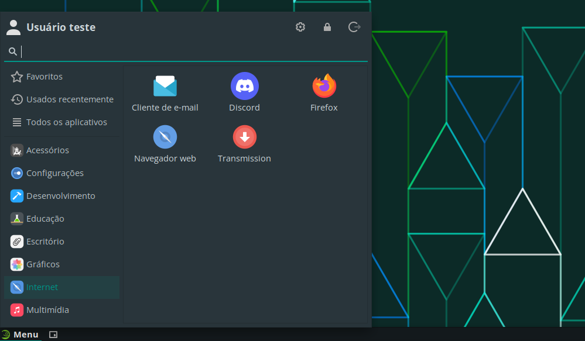

# Discord

O Discord é uma plataforma de comunicação que permite a troca de mensagens, chamadas de voz e vídeo, além de compartilhar arquivos e criar comunidades. É amplamente utilizado por desenvolvedores, _gamers_ e equipes de trabalho.

## Instalação

Para facilitar a instalação, foi criado um *script* que automatiza o processo, de forma que, com um simples comando, o mensageiro é instalado.

Para instalar o Discord, execute o seguinte comando:

```bash
curl -sL https://github.com/jpmsb/preparando-computador-para-engenharia-de-tele/raw/main/scripts-auxiliares/instalar-discord | bash
```

Será perguntado pela senha do seu usuário para prosseguir a instalação. Após a aplicação ter sido instalada, você pode abri-la digitando `discord` no terminal ou pelo menu de aplicativos em **Menu** &rarr; **Internet** &rarr; **Discord**.



<details>
<summary>Observação</summary>
O Discord também pode ser instalado através do repositório oficial do Tumbleweed. Entretanto, essa versão pode não ser a mais recente, carecendo de alguns recursos e correções de bugs. Para instalar o Discord através do repositório, execute o seguinte comando:

```bash
sudo zypper install discord
```

Para desinstalar o Discord instalado através do repositório, execute o comando abaixo:

```bash
sudo zypper remove discord
```
</details>

## Desinstalação

Basta remover os arquivos e diretórios criados pelo *script* de instalação:

```bash
sudo rm -r /opt/Discord* /usr/local/bin/discord /usr/share/applications/discord.desktop
```