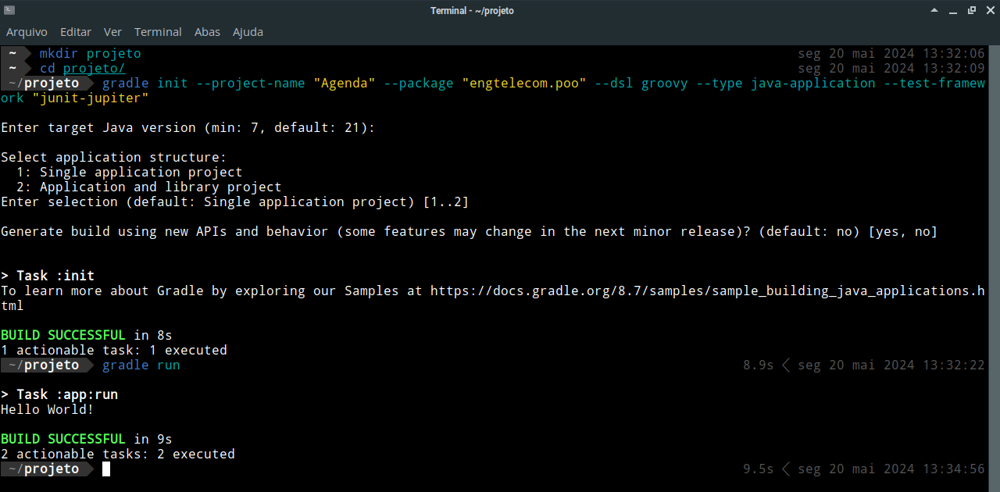

# Gradle

O [Gradle](https://gradle.org/) é uma ferramenta de código aberto que fornece suporte para a automação de compilação, teste, publicação e implantação de software.

### Tabela de Conteúdos

- [Instalação](#instalação)
- [Uso](#uso)
    - [Ajustando a entrada padrão para receber dados do teclado](#ajustando-a-entrada-padrão-para-receber-dados-do-teclado)
    - [Empacotamento da aplicação em um arquivo JAR](#empacotamento-da-aplicação-em-um-arquivo-jar)
- [Desinstalação](#desinstalação)

## Instalação

Para o facilitar o processo de instalação do Gradle, foi criado um *script* que realiza tal processo, obtendo a versão mais recente da ferramenta. A rotina pode ser chamada com o comando

```bash
curl -sL https://github.com/jpmsb/preparando-computador-para-engenharia-de-tele/raw/main/scripts-auxiliares/instalar-gradle | bash
```

Caso você não possua o [JDK (Java Development Kit)]((JDK-21.md)) instalado, a rotina questionará se você deseja instalá-lo. Será perguntada pela sua senha de usuário definida durante a instalação do openSUSE. Após a instalação, você pode verificar se o Gradle foi instalado corretamente com o comando:

```bash
gradle --version
```

A saída é semelhante à abaixo:


**Observação:** caso o JDK tenha sido instalado através desta rotina, é extremamente recomendado reiniciar a sessão para que as aplicações reconheçam a variável `JAVA_HOME` corretamente.

## Uso

Para criar um novo projeto Gradle, em um diretório vazio, execute o seguinte comando:

```bash
gradle init
```

Serão realizadas algumas perguntas para a configuração inicial. Algumas dessas perguntas podem já ser preenchidas através de argumentos de linha de comando. No exemplo abaixo, é criado um projeto Java com o nome "Agenda" e pacote "engtelecom.poo":

```bash
gradle init --project-name "Agenda" --package "engtelecom.poo" --dsl groovy --type java-application --test-framework "junit-jupiter"
```


Note que na imagem acima é possível verificar que algumas perguntas ainda são feitas. Basta apenas pressionar "Enter" para aceitar a opção padrão.

Com o projeto criado, já há um programa de exemplo que pode ser compilado e executado. Para tal, garanta que você possui o JDK (Java Development Kit) instalado, consultando o guia [aqui](JDK-21.md). Feito isso, utilize o seguinte comando dentro do diretório da aplicação:

```bash
gradle run
```

O programa será compilado e executado, exibindo a seguinte saída no terminal:



### Ajustando a entrada padrão para receber dados do teclado

Nas versões mais recentes do Gradle, é preciso ajustar a entrada padrão no arquivo `build.gradle` para que a aplicação possa receber dados do teclado. Para isso, adicione o seguinte conteúdo ao final do arquivo:

```groovy
run {
    standardInput = System.in
}
```

Isso permitirá que classes como `Scanner` possam ser utilizadas para receber dados do teclado.

### Empacotamento da aplicação em um arquivo JAR

O formato `.jar` permite que você consiga executar a sua aplicação através de um único arquivo. Para construir o arquivo `.jar`, primeiramente, adicione as seguintes linhas ao final do seu arquivo `build.gradle`:

```groovy
jar {
    manifest {
        attributes(
            'Main-Class': 'engtelecom.std.Principal'
        )
    }
}
```

No exemplo acima, o atributo `engtelecom.std.Principal` deve ser substituído pelo nome da classe principal do seu projeto. Feito isso, para gerar o arquivo `.jar`, execute o comando:

```bash
./gradlew installDist
```

ou

```bash
gradle installDist
```

O arquivo `.jar` gerado será:

```bash
app/build/libs/app.jar
```

O nome de arquivo `app.jar` é o padrão do projeto. Caso queira que o arquivo seja gerado com outro nome, adicione a seguinte linha ao arquivo `settings.gradle`, localizado na raiz do seu projeto:

```groovy
rootProject.name = 'nome_desejado'
```

Substitua `nome_desejado` pelo nome desejado para o arquivo `.jar`.

Para executar o arquivo `.jar` pela JVM, utilize o comando:

```bash
java -jar arquivo.jar
```

## Desinstalação

Para desinstalar o Gradle, execute o comando:

```bash
sudo rm -r /opt/Gradle/gradle* /usr/local/bin/gradle
```

Caso o Java tenha sido instalado pela rotina deste guia, você pode consultar a documentação para desinstalar o JDK [aqui](JDK-21.md).