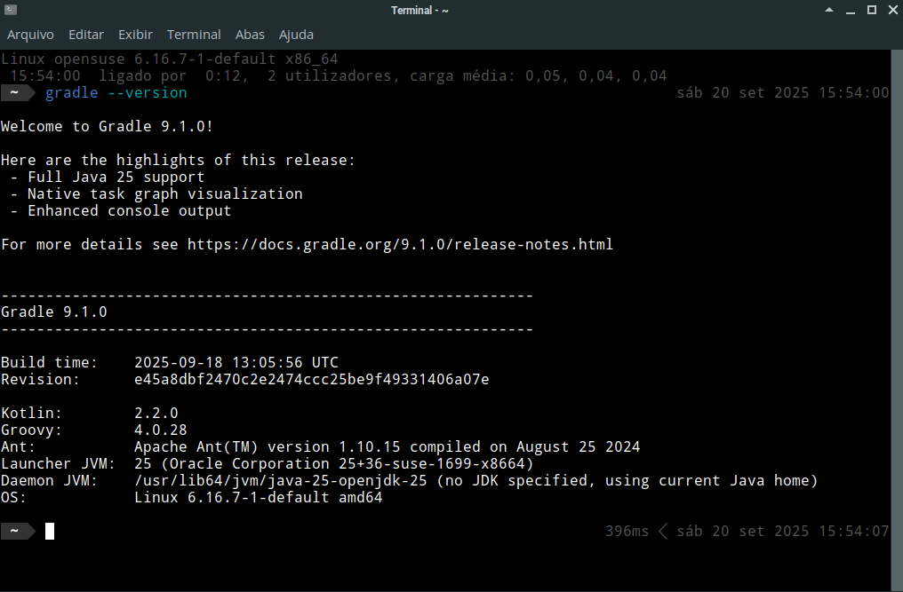

# Gradle

## Instalação

Para o facilitar o processo de instalação do Gradle, foi criado um *script* que realiza tal processo, obtendo a versão mais recente da ferraemnta. A rotina pode ser chamada com o comando

```bash
instalar-gradle
```

Será perguntada pela sua senha de usuário definida durante a instalação do openSUSE. Após a instalação, você pode verificar se o Gradle foi instalado corretamente com o comando:

```bash
gradle --version
```

A saída é semelhante à abaixo:

