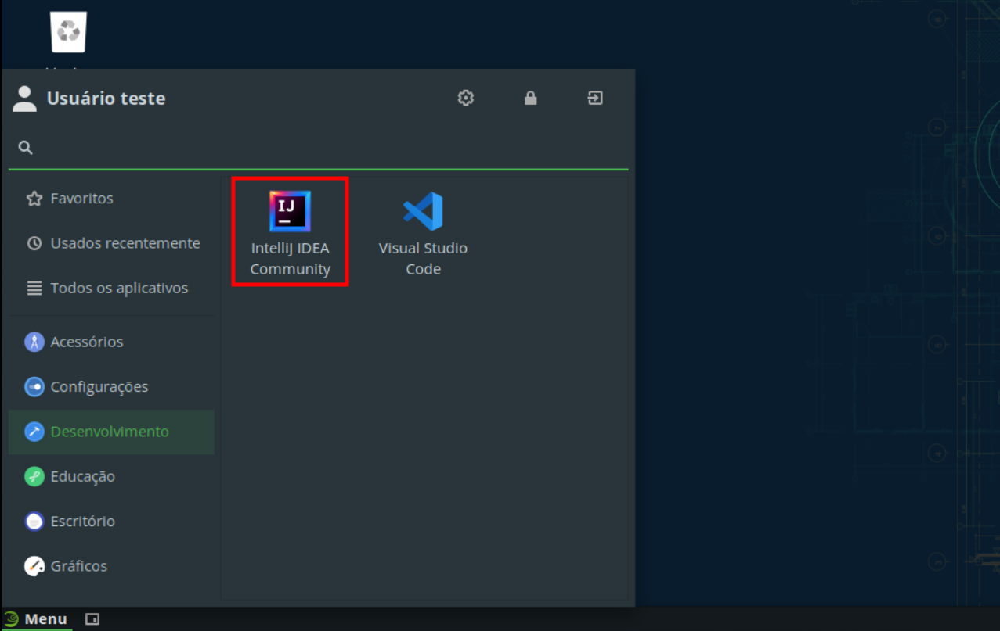
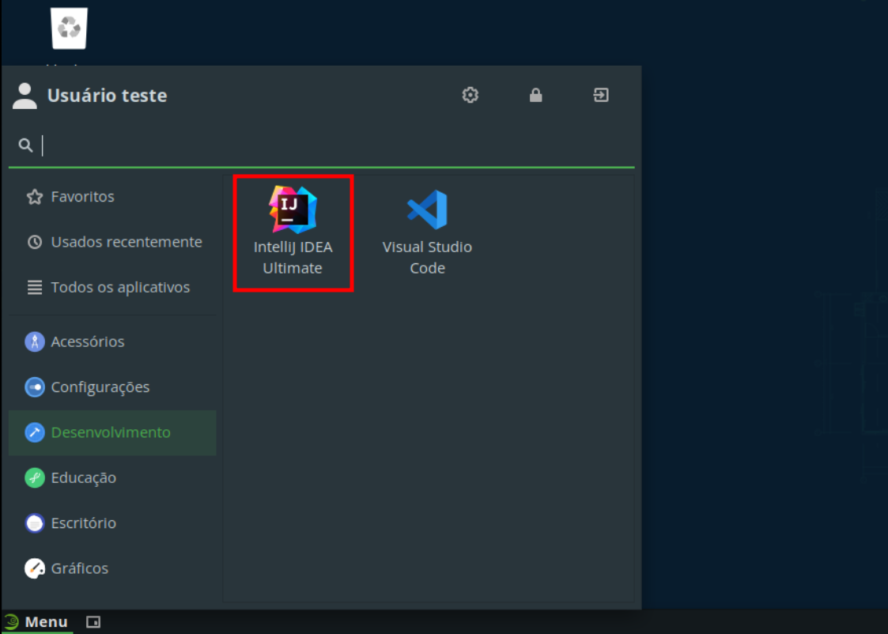
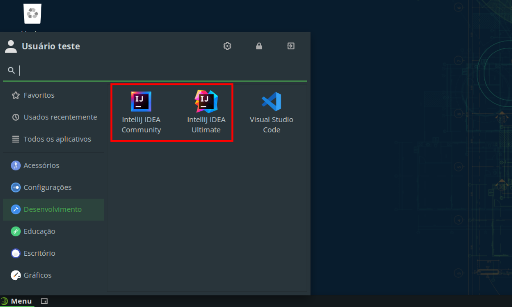

# IntelliJ IDEA

O IntelliJ IDEA é uma IDE da JetBrains com foco em desenvolvimento Java.

### Tabela de conteúdos

- [Instalação](#instalação)
  - [IntelliJ IDEA Community](#intellij-idea-community)
  - [IntelliJ IDEA Ultimate](#intellij-idea-ultimate)
- [Desinstalação](#desinstalação)

## Instalação

Para facilitar a instalação, foram criados *scripts* que automatizam o processo, de forma que, com um simples comando, a IDE é instalada.

Abaixo, será mostrado como instalar o IntelliJ IDEA Community e o IntelliJ IDEA Ultimate, podendo ambos serem instalados lado a lado sem problemas.

### IntelliJ IDEA Community

Para instalar a versão Community do IntelliJ IDEA, execute o seguinte comando:

```bash
curl -sL https://github.com/jpmsb/preparando-computador-para-engenharia-de-tele/raw/main/scripts-auxiliares/instalar-intellij-community | bash
```

Será perguntado pela senha do seu usuário para prosseguir a instalação. Após a IDE ter sido instalada, você pode abri-la digitando `intellij-community` no terminal ou pelo menu de aplicativos em **Menu** &rarr; **Desenvolviment**o &rarr; **IntelliJ IDEA Community**.



### IntelliJ IDEA Ultimate

Para instalar a versão Ultimate do IntelliJ IDEA, execute o seguinte comando:

```bash
curl -sL https://github.com/jpmsb/preparando-computador-para-engenharia-de-tele/raw/main/scripts-auxiliares/instalar-intellij-ultimate | bash
```

Será perguntado pela senha do seu usuário para prosseguir a instalação. Concluída a instalação, você pode abri-la digitando `intellij-ultimate` no terminal ou pelo menu de aplicativos em **Menu** &rarr; **Desenvolvimento** &rarr; **IntelliJ IDEA Ultimate**.



Caso tenha ambos instalados:



## Desinstalação

O processo de desinstalação é simples e basta remover os arquivos e diretórios criados pelos *scripts* de instalação.

 - **IntelliJ IDEA Community**:

    ```bash
    sudo rm -r /opt/JetBrains/IntelliJ-IDEA-Community* /usr/share/applications/intellij-idea-community.desktop /usr/local/bin/intellij-community
    ```

 - **IntelliJ IDEA Ultimate**:

    ```bash
    sudo rm -r /opt/JetBrains/IntelliJ-IDEA-Ultimate* /usr/share/applications/intellij-idea-ultimate.desktop /usr/local/bin/intellij-ultimate
    ```