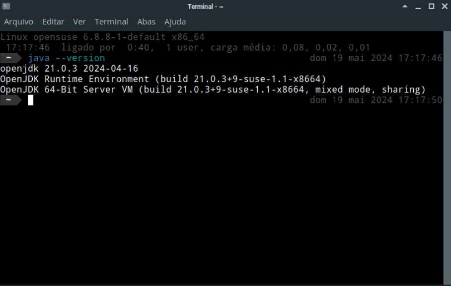

# JDK (Java Development Kit) 21

### Tabela de Conteúdos

- [Instalação](#instalação)
- [Desinstalação](#desinstalação)

## Instalação

Para instalar o JDK 21, basta executar o comando:

```bash
sudo zypper install java-21-openjdk-devel
```

Em seguida, defina a variável de ambiente `JAVA_HOME` com o comando:

- Para todos os usuários (recomendado):

    ```fish
    echo "if type -q java ; set --export JAVA_HOME (dirname (dirname (readlink -f (which java)))) ; end" | sudo tee /etc/fish/conf.d/java_home.fish > /dev/null
    ```

- Apenas para o usuário atual:

    ```fish
    set --export -U JAVA_HOME (dirname (dirname (readlink -f (which java))))
    ```

**Na sequência, reinicie a sua sessão para que a variável de ambiente `JAVA_HOME` seja reconhecida por todas as aplicações.**

Você pode verificar se o JDK foi instalado corretamente com o comando:

```bash
java --version
```

A saída é semelhante à abaixo:



## Desinstalação

Para desinstalar o JDK 21 e demais pacotes instalados com o comando acima, execute o comando:

```bash
sudo zypper remove -u java-21-openjdk
```

Para limpar a variável de ambiente `JAVA_HOME`, execute o comando:

 - Para todos os usuários:

    ```fish
    sudo rm /etc/fish/conf.d/java_home.fish
    ```

 - Para o usuário atual:

    ```fish
    set --erase JAVA_HOME
    ```