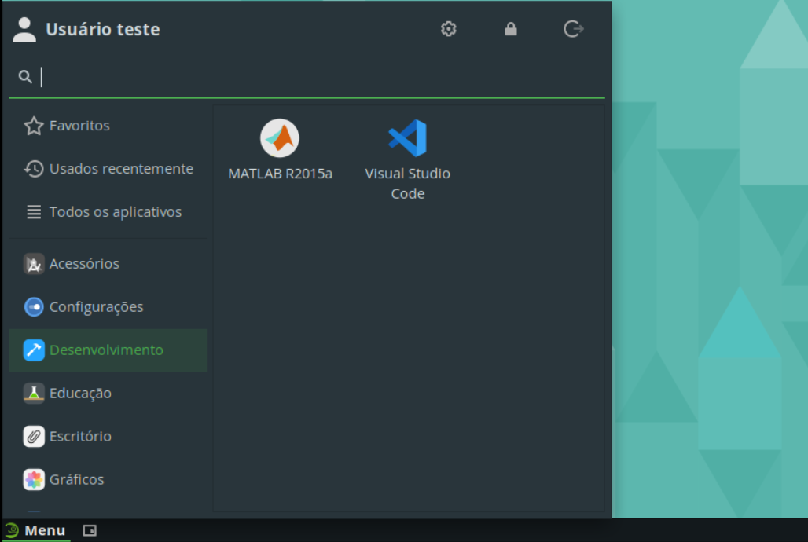
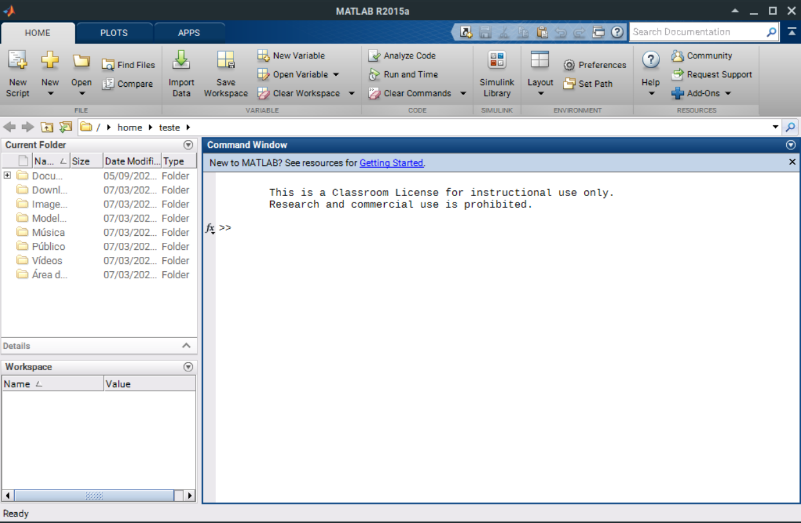
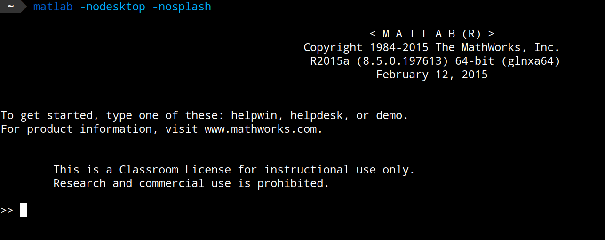

# MATLAB R2015a

O MATLAB é uma ferramenta desenvolvida pela MathWorks que fornece um ambiente interativo para análise numérica, cálculo e visualização de dados. O software é amplamente utilizado em engenharia, matemática e ciências aplicadas.

### Tabela de Conteúdos

- [Instalação](#instalação)
- [Ajuste no arquivo de licença](#ajuste-no-arquivo-de-licença)
- [Tornando o servidor de licença disponível para uso local](#tornando-o-servidor-de-licença-disponível-para-uso-local)
- [Inicializando o MATLAB](#inicializando-o-matlab)
- [Desinstalação](#desinstalação)

## Instalação

Inicialmente, instale as dependências necessárias para o MATLAB:

```bash
sudo zypper install libncurses5
```

Em seguida, copie diretório do MATLAB do servidor remoto do IFSC com o comando `scp`:

```bash
USUARIO=<seu usuário> scp -r $USUARIO@191.36.8.56:/opt/MATLAB .
```

Substitua `<seu usuário>` pelo seu usuário do IFSC, o mesmo utilizado para acessar o SIGAA. Caso você não tenha um usuário, entre em contato com o responsável pela gerência do servidor.

O tamanho total do diretório é de aproximanadamente 5,6 GB. Dessa forma, garanta que há esse espaço livre em seu armazenamento. Além disso, o _download_ pode demorar dependendo da velocidade da conexão.

Finalizada a cópia, mova o diretório 'MATLAB' para '/opt':

```bash
sudo mv MATLAB /opt
```

Em seguida, ajuste as permissões do diretório:

```bash
sudo chown -R root:root /opt/MATLAB
```

Para facilitar o acesso via terminal, execute o comando abaixo:

```bash
echo '#!/bin/bash

MATLAB_DISABLE_CBWR=1                            \
MKL_CBWR=SSE4_2                                  \
MKL_DEBUG_CPU_TYPE=5                             \
/opt/MATLAB/R2015a/bin/matlab "$@"' > ~/.local/bin/matlab
```

Em seguida, dê permissão de execução:

```bash
chmod +x ~/.local/bin/matlab
```

Para acessar através do menu de aplicativos, crie o arquivo ".desktop" necessário com os comandos abaixo:

```bash
mkdir -p ~/.local/share/applications
echo '[Desktop Entry]
Version=1.0
Type=Application
Name=MATLAB R2015a
Icon=matlab
Exec=matlab -desktop
Terminal=false
Categories=TextEditor;Development;IDE;' > ~/.local/share/applications/matlab_r2015a.desktop
```

No menu de aplicativos, o MATLAB estará disponível na categoria "Desenvolvimento".



## Ajuste no arquivo de licença

Esta distribuição do MATLAB funciona somente utilizando a licença do servidor remoto do IFSC. Como o servidor não está disponível para acesso externo, é necessário ajustar o arquivo de licença `/opt/MATLAB/R2015a/licenses/network.lic` para que o MATLAB possa ser utilizado. O conteúdo original do arquivo é:

```
SERVER license-server 000c294e253e 1800
USE_SERVER
```

E deve ser modificado para o seguinte:

```
SERVER 127.0.0.1 000c294e253e 1800
USE_SERVER
```

Isso pode ser feito com o comando:

```bash
sudo sed -i 's/license-server/localhost/' /opt/MATLAB/R2015a/licenses/network.lic
```

Dessa forma o servidor "license-server" é substituído por "localhost".

## Tornando o servidor de licença disponível para uso local

É possível criar um túnel SSH para poder acessar o servidor de licença localmente e, dessa forma, utilizar o MATLAB. **Se isso não for feito, a aplicação não incializará**. Para criar o túnel, execute o comando abaixo:

```bash
USUARIO=<seu usuario> ssh $USUARIO@191.36.8.56 -L 1800:dko:1800 -L 1801:dko:1801 -L 1802:dko:1802 -L 1803:dko:1803 -L 2080:dko:2080 -L 27000:dko:27000
```

Será perguntado a senha do usuário. Informe-a e pressione "Enter". Você acessará um terminal remoto, mas não será preciso interagir com o mesmo. Entretanto, **é necessário mantê-lo aberto enquanto o MATLAB estiver em execução**, do contrário, o servidor de licença não estará disponível.

## Inicializando o MATLAB

Com o servidor de licença configurado para ser acessado localmente, conforme explicado em [Tornando o servidor de licença disponível para uso local](#tornando-o-servidor-de-licença-disponível-para-uso-local), o MATLAB pode ser inicializado através do terminal com o comando `matlab` ou pelo menu de aplicativos.



Caso queira utilizar a ferramenta em modo de linha de comando, execute o comando 

```
matlab -nodesktop -nosplash
```



## Desinstalação

Para desinstalar o MATLAB, execute os seguintes comandos:

```bash
sudo rm -rf /opt/MATLAB
rm ~/.local/bin/matlab
rm ~/.local/share/applications/matlab_r2015a.desktop
```