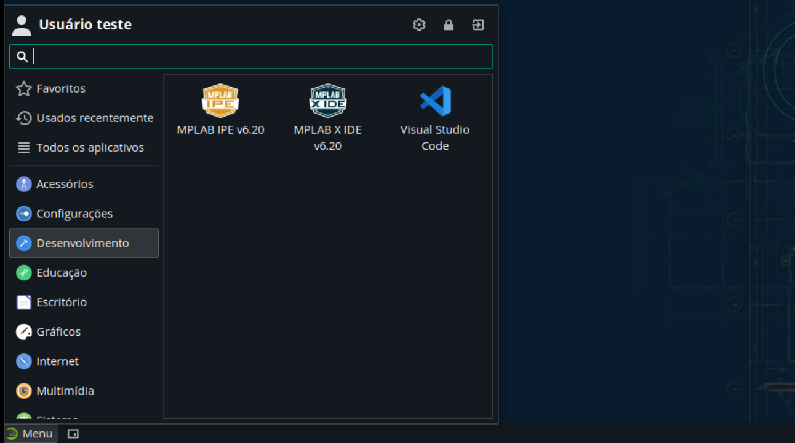
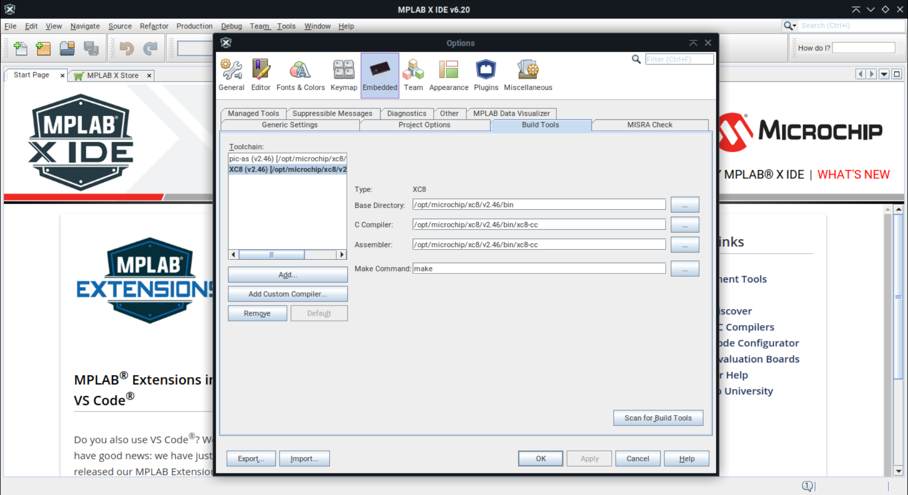

# MPLAB X IDE

O MPLAB X IDE é um ambiente de desenvolvimento integrado (IDE) utilizado para a criação de projeto e programação de microcontroladores.

## Instalação

Para facilitar a instalação, foi criado um *script* que automatiza o processo, de forma que, com um simples comando, a IDE é instalada.

Para instalar o MPLAB X IDE, execute o seguinte comando:

```bash
bash -c "bash <(curl -sL https://github.com/jpmsb/preparando-computador-para-engenharia-de-tele/raw/main/scripts-auxiliares/instalar-mplab-x-ide)"
```

Será perguntado pela senha do seu usuário para prosseguir a instalação. A rotina instala as últimas versões da IDE e do compilador XC8. Após concluído, você pode abrir a aplicação digitando `mplab_ide` em um novo terminal ou pelo menu de aplicativos em **Menu** &rarr; **Desenvolvimento** &rarr; **MPLAB X IDE**.



**Observação**: caso você execute o _script_ de instalação novamente, se houver uma nova versão disponível, esta será instalada. Caso contrário, será perguntado se deseja reinstalar a versão atual.

## Uso

Você pode verificar se o compilador XC8 foi instalado e detectado corretamente indo no menu `Tools` &rarr; `Options` &rarr; aba `Embedded` &rarr; aba `Build Tools` e verificando se o XC8 está listado, conforme mostrado abaixo:



## Desinstalação

Para desinstalar o MPLAB X IDE, execute o seguinte comando, basta remover os arquivos e diretórios criados durante a instalação:

```bash
sudo rm -r /opt/microchip/mplabx/v6.20/ /opt/microchip/mplabcomm/3.53.00/ /opt/microchip/xc8/ /opt/microchip/xclm/ /usr/bin/mplab_ide /usr/bin/mplab_ipe /usr/share/applications/mplab_ide-v6.20.desktop /usr/share/applications/mplab_ipe-v6.20.desktop
```