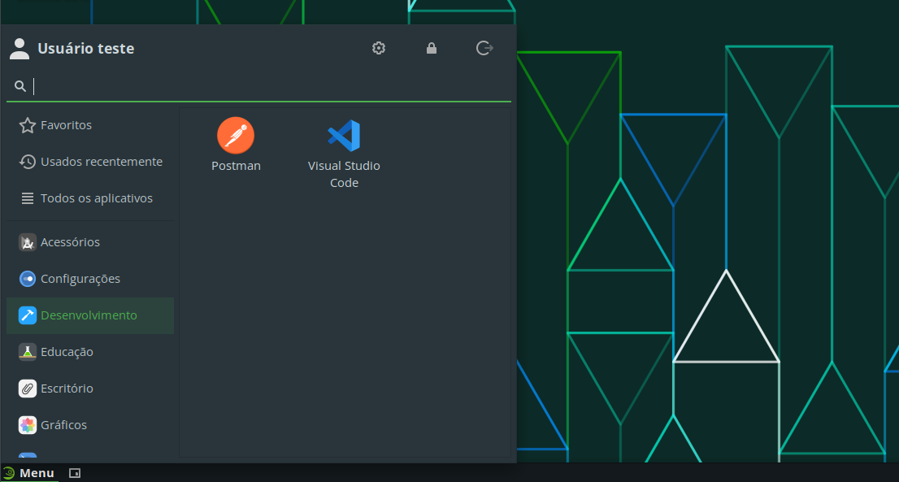

# Postman

O Postman é uma ferramenta que permite testar APIs de forma rápida e fácil.

## Instalação

Para facilitar a instalação, foi criado um *script* que automatiza o processo, de forma que, com um simples comando, a ferramenta é instalada.

Para instalar o Postman, execute o seguinte comando:

```bash
curl -sL https://github.com/jpmsb/preparando-computador-para-engenharia-de-tele/raw/main/scripts-auxiliares/instalar-postman | bash
```

Será perguntado pela senha do seu usuário para prosseguir a instalação. Após a ferramenta ter sido instalada, você pode abri-la digitando `postman` no terminal ou pelo menu de aplicativos em **Menu** &rarr; **Desenvolvimento** &rarr; **Postman**.



## Desinstalação

Basta remover os arquivos e diretórios criados pelo *script* de instalação:

```bash
sudo rm -r /opt/Postman* /usr/local/bin/postman /usr/share/applications/postman.desktop
```