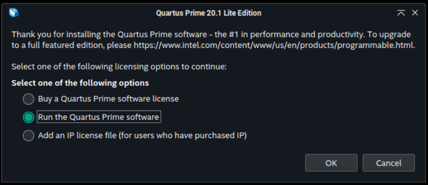
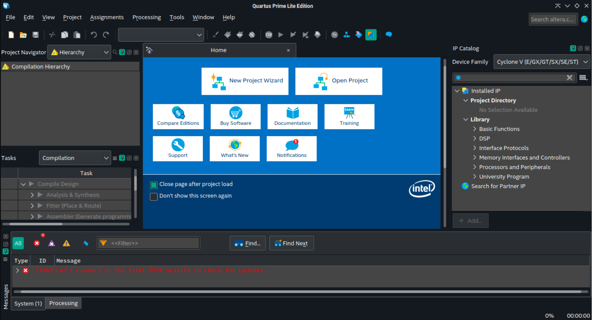

# Quartus Prime Lite 20.1.1

O Quartus Prime é uma IDE para desenvolvimento de projetos em FPGA. A versão Lite é gratuita e possui algumas limitações em relação a versão Pro, mas é suficiente para a maioria dos projetos.

Vale salientar que o lançamento 20.1.1 é o último que acompanha o ModelSim, um simulador de VHDL e Verilog. A partir da versão 21.1, o mesmo foi substituído pelo [Questa*-Intel FPGA Edition](https://www.intel.com.br/content/www/br/pt/software/programmable/quartus-prime/questa-edition.html).

### Tabela de conteúdos

- [Instalação](#instalação)
- [Uso](#uso)
  - [Customização das cores do console](#customização-das-cores-do-console)
  - [Configurações do editor de texto](#configurações-do-editor-de-texto)
    - [Cores do editor de texto](#cores-do-editor-de-texto)
- [Desinstalação](#desinstalação)

## Instalação

Para facilitar a instalação, foi criado um *script* que automatiza o processo, de forma que, com um simples comando, a IDE é instalada.

Para instalar o Quartus Prime Lite 20.1.1, execute o seguinte comando:

```bash
curl -sL https://github.com/jpmsb/preparando-computador-para-engenharia-de-tele/raw/main/scripts-auxiliares/instalar-quartus-prime-lite-20.1.1 | bash
```

Será perguntado pela senha do seu usuário para prosseguir a instalação. Após a IDE ter sido instalada, você pode abri-la digitando `quartus` em um novo terminal ou pelo menu de aplicativos em **Menu** &rarr; **Desenvolvimento** &rarr; **Quartus Prime Lite Edition 20.1.1**.

## Uso

Na tela que aparece quando o Quartus é executado pela primeira vez, selecione a opção "Run the Quartus Prime software" e clique em "OK".



A aplicação abrirá, conforme mostrado abaixo:



Abaixo, estão listadas algumas customizações de cores que melhoram a experiência em temas escuros. Além disso, alguns recursos do editor de texto são habilitados.

### Customização das cores do console

O comando abaixo ajusta as cores do console para melhor visualização em temas escuros.

```bash
echo 'Altera_Foundation_Class\Color_version=8
Altera_Foundation_Class\AFCQ_MSW_INFO_COLOR=@Variant(\0\0\0\x43\x1\xff\xff\0\0\xff\xff\0\0\0\0)
Altera_Foundation_Class\AFCQ_MSW_HIGHLIGHT_KEYWORD_COLOR=@Variant(\0\0\0\x43\x1\xff\xff\xff\xff\xff\xff\xff\xff\0\0)
Altera_Foundation_Class\AFCQ_MSW_ERROR_COLOR=@Variant(\0\0\0\x43\x1\xff\xff\xff\xff\x8e\x8e\x8e\x8e\0\0)
Altera_Foundation_Class\AFCQ_MSW_CRITICAL_WARNING_COLOR=@Variant(\0\0\0\x43\x1\xff\xff\0\0\xfb\xfb\xff\xff\0\0)
Altera_Foundation_Class\AFCQ_MSW_WARNING_COLOR=@Variant(\0\0\0\x43\x1\xff\xff\0\0\xbb\xbb\xff\xff\0\0)' >> $HOME/.altera.quartus/quartus2.qreg
```

### Configurações do editor de texto

O comando abaixo ajusta as configurações do editor de texto, habilitando recursos como autocompletar e marcações de erros.

```bash
echo 'Text_Editor\show_line_number=true
Text_Editor\show_new_line_marker=true
Text_Editor\auto_indent=true
Text_Editor\save_backup_file=true
Text_Editor\insert_space_for_tab=true
Text_Editor\enable_calltip=true
Text_Editor\show_white_space=false
Text_Editor\show_indentation_guide=false
Text_Editor\print_color_mode=0
Text_Editor\enable_highlight_instances=true
Text_Editor\enable_show_error_mark=true
Text_Editor\enable_classic_find_dialog=false
Text_Editor\split_vertical_orientation=true
Text_Editor\tab_size=3
Text_Editor\save_template_file_to=
Quartus_UI_Framework\Detach_on_openingText_Editor=false
Text_Editor\show_autocomplete_list=true
Text_Editor\enable_autocomplete_on_syntax_keywords=true
Text_Editor\enable_autocomplete_on_local_keywords=true
Text_Editor\enable_autocomplete_on_deliminiters=true' >> $HOME/.altera.quartus/quartus2.qreg
```

#### Cores do editor de texto

```bash
echo 'Altera_Foundation_Class\AFCQ_TED_BACKGROUND_COLOR=@Variant(\0\0\0\x43\x1\xff\xff\x1f\x1f\x1f\x1f\x1f\x1f\0\0)
Altera_Foundation_Class\AFCQ_TED_KEYWORD_COLOR=@Variant(\0\0\0\x43\x1\xff\xff\xff\xff\xff\xffTT\0\0)
Altera_Foundation_Class\AFCQ_TED_VERILOG_KEYWORDS_COLOR=@Variant(\0\0\0\x43\x1\xff\xff\xff\xff\xff\xffTT\0\0)
Altera_Foundation_Class\AFCQ_TED_TCL_KEYWORDS_COLOR=@Variant(\0\0\0\x43\x1\xff\xff\xff\xff\xff\xffTT\0\0)
Altera_Foundation_Class\AFCQ_TED_SYS_VERILOG_KEYWORDS_COLOR=@Variant(\0\0\0\x43\x1\xff\xff\xff\xff\xff\xffTT\0\0)
Altera_Foundation_Class\AFCQ_TED_VHDL_KEYWORDS_COLOR=@Variant(\0\0\0\x43\x1\xff\xff\xff\xff\xff\xffTT\0\0)
Altera_Foundation_Class\AFCQ_TED_NORMAL_COLOR=@Variant(\0\0\0\x43\x1\xff\xff\xff\xff\xff\xff\xff\xff\0\0)
Altera_Foundation_Class\AFCQ_TED_VHDL_STANDARD_PACKAGES=@Variant(\0\0\0\x43\x1\xff\xff\x86\x86\xff\xff\xae\xae\0\0)
Altera_Foundation_Class\AFCQ_TED_NUMBER_COLOR=@Variant(\0\0\0\x43\x1\xff\xff\xff\xffTT\xfd\xfd\0\0)
Altera_Foundation_Class\AFCQ_TED_STRING_COLOR=@Variant(\0\0\0\x43\x1\xff\xff\xff\xff\xaa\xaa\xff\xff\0\0)
Altera_Foundation_Class\AFCQ_TED_CALLTIP_FONT="1 AFCQ_WINDOW_TOOLTIP_TEXT_COLOR AFCQ_WINDOW_TOOLTIP_BKGND_COLOR 10 0 0 0 0 0 0, Intel Clear"
Altera_Foundation_Class\AFCQ_TED_TEXT_FONT="1 AFCQ_WINDOW_TEXT_COLOR AFCQ_WINDOW_BACKGROUND_COLOR 10 0 0 0 0 1 2, Monospace"
Altera_Foundation_Class\AFCQ_TED_MULTI_COLOR=@Variant(\0\0\0\x43\x1\xff\xffTT\xff\xff\xff\xff\0\0)
Altera_Foundation_Class\AFCQ_TED_SINGLE_COLOR=@Variant(\0\0\0\x43\x1\xff\xffTT\xff\xff\xff\xff\0\0)
Altera_Foundation_Class\AFCQ_TED_IDENTIFIER_COLOR=@Variant(\0\0\0\x43\x1\xff\xff\xff\xff\0\0\xff\xff\0\0)
Altera_Foundation_Class\AFCQ_TED_LINE_NUMBER_COLOR=@Variant(\0\0\0\x43\x1\xff\xff\xef\xef\xf0\xf0\xf1\xf1\0\0)
Altera_Foundation_Class\AFCQ_TED_SELECTION_BG_COLOR=@Variant(\0\0\0\x43\x1\xff\xff\0\0\xa4\xa4\x88\x88\0\0)
Altera_Foundation_Class\AFCQ_TED_LINE_BACKGROUND_COLOR=@Variant(\0\0\0\x43\x1\xff\xff\x1e\x1e\x1e\x1e\x1e\x1e\0\0)
Altera_Foundation_Class\AFCQ_TED_TCL_MODIFIER_COLOR=@Variant(\0\0\0\x43\x1\xff\xff\x87\x87\x87\x87\x87\x87\0\0)
Altera_Foundation_Class\AFCQ_TED_BOOKMARK_COLOR=@Variant(\0\0\0\x43\x1\xff\xff\xff\xff\xff\xff\xbf\xbf\0\0)' >> $HOME/.altera.quartus/quartus2.qreg
```

### Destravando a gravação no Kit FPGA

Em dados momentos, ao tentar realizar a gravação do código compilado na placa, a tela do _Programmer_ pode não responder após clicar em _Start_. Para resolver este problema, abra um terminal e execute o comando abaixo:

```bash
pkill -f jtagd -9; /opt/intelFPGA/Quartus-lite/20.1.1/quartus/bin/jtagd --user-start;  /opt/intelFPGA/Quartus-lite/20.1.1/quartus/bin/jtagconfig
```

Caso uma placa esteja conectada e ligada, o resultdo deverá ser semelhante ao mostrado abaixo:

```bash
1) USB-Blaster [N-N]
  020F40DD   10CL040(Y|Z)/EP3C40/EP4CE30/..
```

## Desinstalação

Basta remover os arquivos e diretórios criados pelo *script* de instalação:

```bash
sudo rm -r /opt/intelFPGA/Quartus-lite/20.1.1/ /usr/share/applications/quartus-prime-lite-edition-20.1.1.desktop /etc/profile.d/quartus_path_20.1.1.sh /etc/fish/conf.d/quartus_path_20.1.1.fish
```

Em seguida, remova os pacotes instalados:

```bash
sudo zypper remove glibc-32bit glibc-gconv-modules-extra-32bit libbrotlicommon1-32bit libbrotlidec1-32bit libbz2-1-32bit libexpat1-32bit libfontconfig1-32bit libfreetype6-32bit libpng16-16-32bit libX11-6-32bit libXau6-32bit libxcb1-32bit libXft2-32bit libXrender1-32bit libz1-32bit nss-mdns-32bit samba-client-32bit libXext6-32bit libgcc_s1-32bit
```