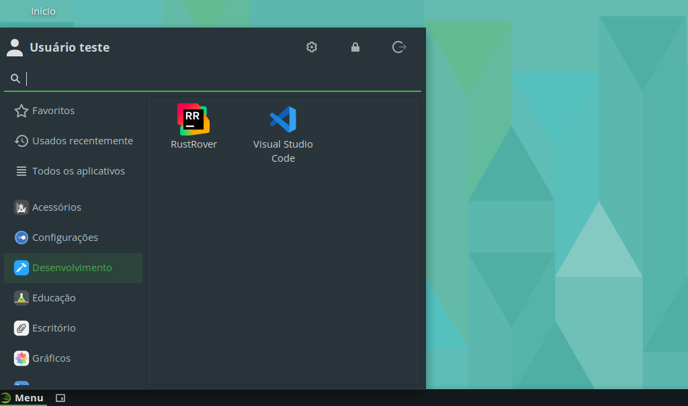

# RustRover

O RustRover é uma IDE da JetBrains com foco em desenvolvimento na linguagem Rust.

## Instalação

Para facilitar a instalação, foi criado um *script* que automatiza o processo, de forma que, com um simples comando, a IDE é instalada.

Para instalar o RustRover, execute o seguinte comando:

```bash
curl -sL https://github.com/jpmsb/preparando-computador-para-engenharia-de-tele/raw/main/scripts-auxiliares/instalar-rustrover | bash
```

Será perguntado pela senha do seu usuário para prosseguir a instalação. Após a IDE ter sido instalada, você pode abri-la digitando `rustrover` no terminal ou pelo menu de aplicativos em **Menu** &rarr; **Desenvolvimento** &rarr; **RustRover**.



## Desinstalação

Basta remover os arquivos e diretórios criados pelo *script* de instalação.

```bash
sudo rm -r /opt/JetBrains/RustRover* /usr/share/applications/rustrover.desktop /usr/local/bin/rustrover
```