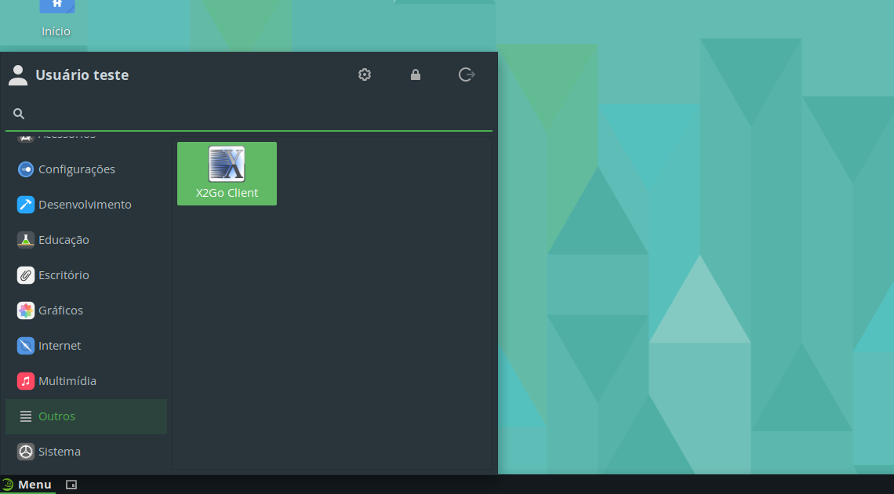
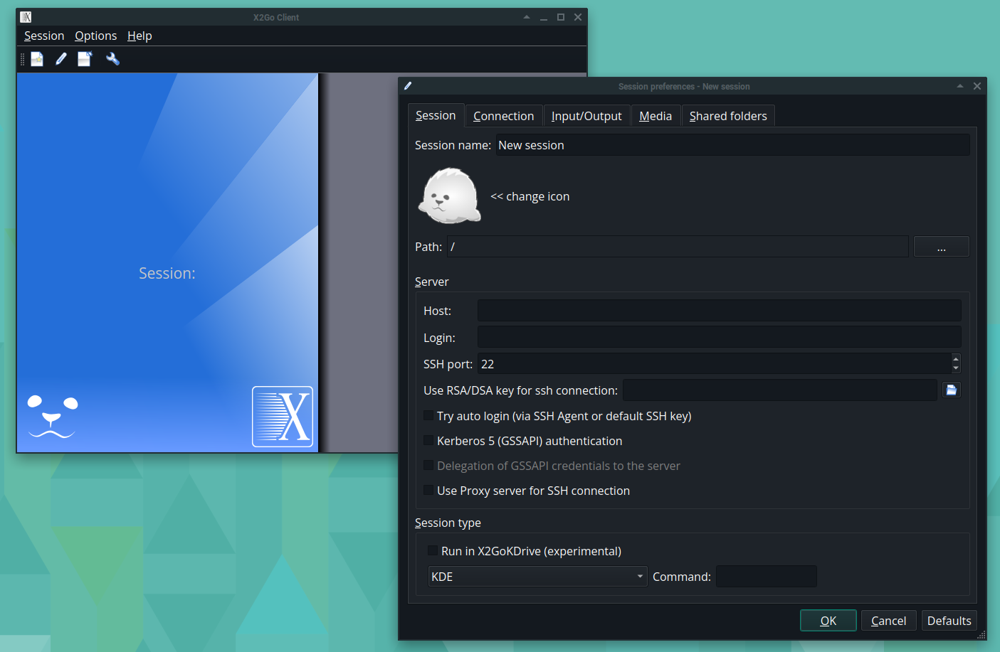

# X2Go Client

O X2Go é um software de código aberto que permite o acesso remoto a um ambiente gráfico de um computador através de uma rede. Ele é baseado no protocolo NX, e é uma forma de acessar aplicativos gráficos ou ambientes de trabalho inteiros, com vários parâmetros que podem ser ajustados para melhorar o desempenho do acesso.

## Instalação

Para instalar o X2Go Client, execute os seguintes comandos:

```bash
sudo zypper refresh -f
sudo zypper install x2goclient
```

Após a instalação, você pode abri-la digitando `x2goclient` no terminal ou pelo menu de aplicativos em **Menu** &rarr; **Outros** &rarr; **X2Go Client**.



## Primeira execução

Quando aberto pela primeira vez, a aplicação oferecerá a configuração de um novo servidor para acesso.



## Desinstalação

Para desinstalar o X2Go Client, execute o seguinte comando:

```bash
sudo zypper remove x2goclient libXcomp3 nxproxy
```